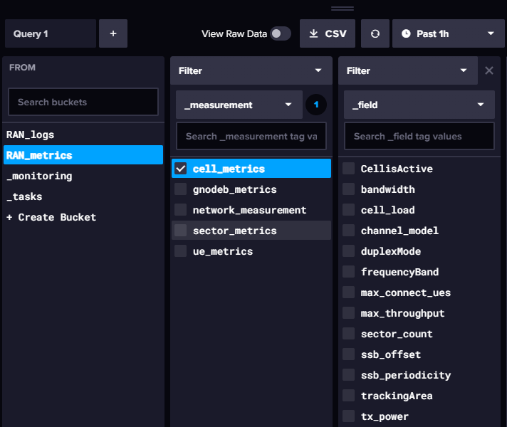

# Welcome to RAN Fusion  
#  


## Overview

**RANFusion RAN Simulator** simulates the behavior and performance of 5G and 6G networks, focusing on handover processes. It provides a detailed framework for testing and analyzing 5G technology components.

### Sample Results

- **Initial UE Configuration**

  

- **Simulation Logs**

  

- **InfluxDB GUI for Performance Metrics**

  

## Features

- **Realistic RAN Simulation:** Models 5G network elements and protocols accurately.
- **Multi-Support:** For multiple gNodeB, Cells, Sectors, and UEs.
- **API Enabled:** To add, remove, and update UEs with parameters.
- **Customizable Scenarios:** For configuring various network scenarios.
- **Supported Scenarios:** Traffic generation for UEs and soft handover within GnodeB.
- **Performance Metrics via InfluxDB:** Comprehensive metrics for insightful 5G network analysis.

## Getting Started

### Prerequisites

- **Operating System:** Windows, Linux, or macOS.
- **Python:** Version 3.x.
- **Dependencies:** Install via `pip install -r requirements.txt`.

### Installation Guide

1. **Clone the Repository:** Obtain the project on your machine.
2. **Navigate:** Move to the project directory.
3. **Setup:** Execute `setup.py` and wait.
4. **InfluxDB:** Install and setup on your machine.
5. **API Token:** Get the API token from InfluxDB GUI (`http://localhost:8086/`).
6. **Configure:** Insert the token into `setup.py`.
7. **Run:** Start the simulation with `main.py`.
 
## Documentation
Explore RANFusion further in our documentation.(https://RANFusion.com/doc).

### API Sample

To remove a UE:
```powershell
Invoke-RestMethod -Uri 'http://localhost:5000/remove_ue' -Method Post -ContentType 'application/json' -Body '{"ue_id": "UE10", "sector_id": "AX1112-A1"}'   
